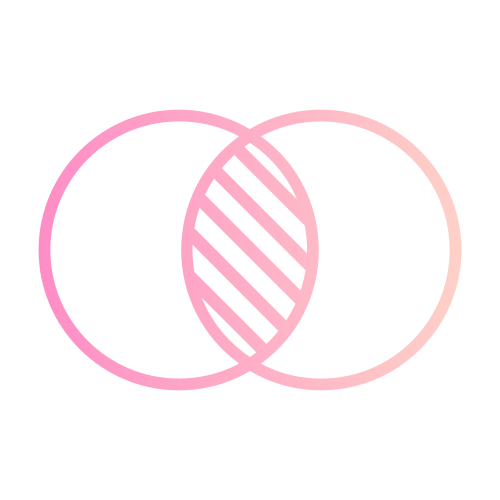
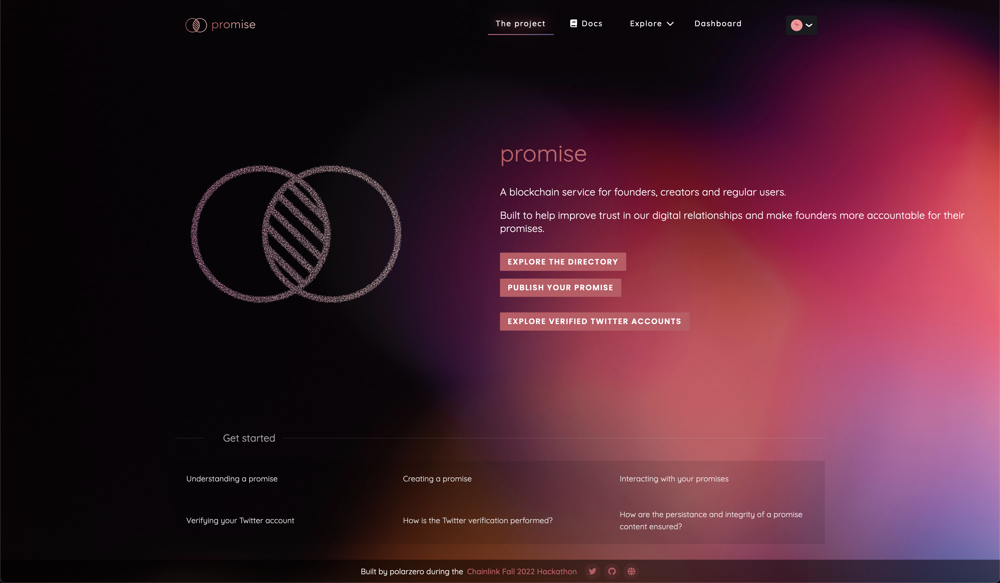

<a name="readme-top"></a>

**Because of the recent changes in the Twitter API pricing policy ($100/month for read access), this project can no longer be used at its full extent.**

<!-- PROJECT LOGO -->
<br />
<div align="center">
  <a href="https://github.com/0xpolarzero/chainlink-fall-2022-hackathon">
    
  </a>

<h2 align="center"><b>promise</b> - a blockchain service for founders, creators and regular users.</h3>

  <p align="center">
    Built to help improve trust in our digital relationships and make founders more accountable for their promises.
    <br />
    <a href="https://docs.usepromise.xyz/"><strong>Explore the documentation »</strong></a>
    <br /><br />
    <a href="https://usepromise.xyz/">View Demo (Vercel)</a>
    ·
    <a href="https://ipfs.usepromise.xyz/">View Demo (Fleek)</a>
    ·
    <a href="https://github.com/0xpolarzero/chainlink-fall-2022-hackathon/issues">Report Bug</a>
    ·
    <a href="https://github.com/0xpolarzero/chainlink-fall-2022-hackathon/issues">Request Feature</a>
  </p>
</div>

<br />

<!-- TABLE OF CONTENTS -->
<details>
  <summary>Table of Contents</summary>
  <ol>
    <li>
      <a href="#about-promise">About promise</a>
      <ul>
        <li><a href="#built-with">Built with</a></li>
      </ul>
    </li>
    <li>
      <a href="#testing">Trying out / testing</a>
    </li>
    <li><a href="#license">License</a></li>
    <li><a href="#contact">Contact</a></li>

  </ol>
</details>

<br />

<!-- ABOUT THE PROJECT -->

# About promise



## What is promise?

Promise is a blockchain service for founders, creators and regular users. The end purpose is to **improve trust in our digital relationships** and make founders more accountable for their promises. It is both a way for gathering information about a team and their project, and for them to make a genuine commitment that cannot be altered.

This tool cannot enforce compliance with an objective or a commitment. But, one can imagine that such a process, if it became usual, could provide a much appreciated transparency and permanence in the _Web3_ ecosystem, and more extensively in projects that involve significant investments.

In everything gravitating around blockchain, among other things, Twitter has become a corporate medium, used for business and marketing. A Twitter account, as well as an Ethereum address, can be crucial to the reputation of a person, a brand, a community, a product or a service.

By **putting them at stake in a promise**, in a transparent and verifiable process, **it might provide a lucid picture, and an uncensorable record, of the reliability of a person or a group** - or at least, **of their willingness to be held accountable for their actions**.

## Quick note

This project is the product of a month of intense work, research, learning and struggle, as part of the Chainlink Fall 2022 Hackathon.

Many thanks to Chainlink for this timely opportunity - the hackathon started the day I finished Patrick Collins 32h course on Full-Stack Blockchain Development, and I was able to put all my new knowledge to good use.

As I'm writing this, one month after the hackathon started, and two months after I started learning Solidity, I feel like I've already come a long way. I am very proud of the result, and I hope you will enjoy it as much as I did - and still do - building it.

Should you be curious to know more about the application, I strongly suggest to have a glance at the documentation, in which I explain in depth how it operates, and how to use it.

### <a href="https://docs.usepromise.xyz/"><strong>Explore the documentation »</strong></a>

<br />

## Built with

### Contracts

[![Solidity]](https://soliditylang.org/)
[![JavaScript]](https://developer.mozilla.org/fr/docs/Web/JavaScript)
[![Hardhat]](https://hardhat.org/)
[![Chainlink]](https://chain.link/)
[![Chai]](https://www.chaijs.com/)

### Storage

[![IPFS]](https://ipfs.tech/)
[![Web3Storage]](https://web3.storage/)
[![Filecoin]](https://filecoin.io/)
[![Arweave]](https://www.arweave.org/)
[![Bundlr]](https://bundlr.network/)

### Infrastructure

[![Polygon]](https://polygon.technology/)
[![TheGraph]](https://thegraph.com/en/)
[![ApolloGraphQL]](https://www.apollographql.com/)
[![AWS]](https://aws.amazon.com/lambda/)
[![NodeJS]](https://nodejs.org/)
[![Express]](https://expressjs.com/)

### Interaction with contracts

[![Rainbow]](https://www.rainbowkit.com/)
[![Wagmi]](https://wagmi.sh/)
[![EthersJS]](https://docs.ethers.io/v5/)
[![Quicknode]](https://www.quicknode.com/)

### Frontend

[![NextJS]](https://nextjs.org/)
[![Antd]](https://ant.design/)

<!-- GETTING STARTED -->

<!----><a id="testing"></a>

# Trying out / testing

<p>To get a local copy up and running follow these simple example steps.</p>
<p>You will need to install either <strong>npm</strong> or <strong>yarn</strong> to run the commands, and <strong>git</strong> to clone the repository.</p>

## Installation

1. Clone the repo:
   ```sh
   git clone https://github.com/0xpolarzero/chainlink-fall-2022-hackathon
   ```
2. Navigate into a subdirectory:
   ```sh
   cd name-of-the-subdirectory
   ```
3. Install NPM packages using `yarn` or `npm install`.

## Usage

Usage strongly depends on the subdirectory you are in. Please refer to the README.md file in each subdirectory for more information.

# License

Distributed under the MIT License. See `LICENSE.txt` for more information.

<!----><a id="contact"></a>

# Contact - Social

[![Website][website]](https://polarzero.xyz/)
[![Twitter][twitter]](https://twitter.com/0xpolarzero/)
[![LinkedIn][linkedin]](https://www.linkedin.com/in/antton-lepretre/)
[![0xpolarzero@gmail.com][email]](mailto:0xpolarzero@gmail.com)

Project Link: <strong><a href="https://github.com/0xpolarzero/chainlink-fall-2022-hackathon">https://github.com/0xpolarzero/chainlink-fall-2022-hackathon</a></strong>

<p align="right">(<a href="#readme-top">back to top</a>)</p>

<!-- MARKDOWN LINKS & IMAGES -->
<!-- https://www.markdownguide.org/basic-syntax/#reference-style-links -->

[website]: https://img.shields.io/badge/website-000000?style=for-the-badge&logo=About.me&logoColor=white
[twitter]: https://img.shields.io/badge/Twitter-1DA1F2?style=for-the-badge&logo=twitter&logoColor=white
[linkedin]: https://img.shields.io/badge/LinkedIn-0077B5?style=for-the-badge&logo=linkedin&logoColor=white
[email]: https://img.shields.io/badge/0xpolarzero@gmail.com-D14836?style=for-the-badge&logo=gmail&logoColor=white
[solidity]: https://custom-icon-badges.demolab.com/badge/Solidity-3C3C3D?style=for-the-badge&logo=solidity&logoColor=white
[chainlink]: https://img.shields.io/badge/Chainlink-375BD2.svg?style=for-the-badge&logo=Chainlink&logoColor=white
[javascript]: https://img.shields.io/badge/JavaScript-F7DF1E.svg?style=for-the-badge&logo=JavaScript&logoColor=black
[nodejs]: https://img.shields.io/badge/Node.js-339933.svg?style=for-the-badge&logo=nodedotjs&logoColor=white
[express]: https://img.shields.io/badge/Express.js-000000.svg?style=for-the-badge&logo=express&logoColor=white
[ethersjs]: https://custom-icon-badges.demolab.com/badge/Ethers.js-29349A?style=for-the-badge&logo=ethers&logoColor=white
[hardhat]: https://custom-icon-badges.demolab.com/badge/Hardhat-181A1F?style=for-the-badge&logo=hardhat
[chai]: https://img.shields.io/badge/Chai-A30701.svg?style=for-the-badge&logo=Chai&logoColor=white
[nextjs]: https://img.shields.io/badge/next.js-000000?style=for-the-badge&logo=nextdotjs&logoColor=white
[ipfs]: https://img.shields.io/badge/IPFS-0A1B2B?style=for-the-badge&logo=ipfs&logoColor=white
[rainbow]: https://custom-icon-badges.demolab.com/badge/Rainbowkit-032463?style=for-the-badge&logo=rainbow
[wagmi]: https://custom-icon-badges.demolab.com/badge/Wagmi-1C1B1B?style=for-the-badge&logo=wagmi
[antd]: https://img.shields.io/badge/Ant%20Design-0170FE.svg?style=for-the-badge&logo=Ant-Design&logoColor=white
[thegraph]: https://custom-icon-badges.demolab.com/badge/TheGraph-0C0A1C?style=for-the-badge&logo=thegraph&logoColor=white
[apollographql]: https://img.shields.io/badge/Apollo%20GraphQL-311C87.svg?style=for-the-badge&logo=Apollo-GraphQL&logoColor=white
[aws]: https://img.shields.io/badge/AWS%20Lambda-FF9900.svg?style=for-the-badge&logo=AWS-Lambda&logoColor=white
[polygon]: https://custom-icon-badges.demolab.com/badge/Polygon-7342DC?style=for-the-badge&logo=polygon&logoColor=white
[web3storage]: https://custom-icon-badges.demolab.com/badge/Web3%20Storage-3C3CC8?style=for-the-badge&logo=web3storage&logoColor=white
[filecoin]: https://custom-icon-badges.demolab.com/badge/Filecoin-3F8EF7?style=for-the-badge&logo=filecoin-
[quicknode]: https://custom-icon-badges.demolab.com/badge/Quicknode-49A1D1?style=for-the-badge&logo=quicknode-&logoColor=white
[arweave]: https://custom-icon-badges.demolab.com/badge/Arweave-222326?style=for-the-badge&logo=arweave-
[bundlr]: https://custom-icon-badges.demolab.com/badge/Bundlr-CEE1E4?style=for-the-badge&logo=bundlr&logoColor=black
