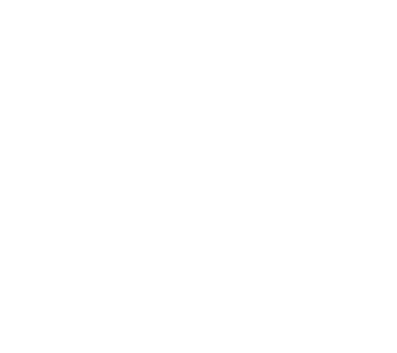

# Exploring promises

## Introduction

<figure><figcaption>
Go to the <em>Explore promises</em> page from the menu.
</figcaption></figure>

The _Explore Promises_ page shows the last created promises, and allows you to search through the available content. You can make a search using a promise name, an Ethereum address, the name or the Twitter handle of a participant.

## What does a promise look like?

<figure><figcaption>
An example promise as it is displayed on the App.
</figcaption></figure>

All information and variables of the promise are stored on-chain, in its own smart contract, and fetched before it can be displayed. The content is requested from IPFS to be displayed as well. There are various sections in the promise card:

Contract address

The address of the contract, generated by the factory when the promise was created. It holds all information, and only its participants can interact with it.

IPFS CID

The IPFS hash pointing to the content uploaded by the creator of the promise.

The verification status

Shown as a Ribbon, the verification status is the result of the request to the Chainlink External Adapter, to verify the issuance of the promise, and therefore the reliability of the provided links (cf. [ipfs-and-arweave-verification.md](../chainlink-external-adapters/ipfs-and-arweave-verification.md "mention")).

It can hold various states:

_****_:hourglass: <mark style="color:red;">**Verification pending...**</mark>

\-> The promise was just created, and it is not yet verified.

❌ __ <mark style="color:red;">**Not verified**</mark>

\-> The External Adapter could not verify the promise, which means that it was not created through the App. Therefore, the source of the IPFS CID & Arweave ID cannot be insured.

****:white\_check\_mark: **Verified (IPFS)**

\-> The promise was created using the App. Thus, a deal was made for us to pick up (pin) the content of the promise, through the Filecoin network (cf. [sending-to-the-ipfs-network.md](../ipfs-and-arweave/sending-to-the-ipfs-network.md "mention")).

****:white\_check\_mark: **Verified (IPFS & Arweave)**

\-> Everything mentioned above + the content was _zipped_ and sent permanently to the Arweave blockchain, using Bundlr. The archive can be downloaded from Arweave by clicking a link, shown when hovering on the badge.

<figure><figcaption>
The verification status.
</figcaption></figure>

Involved parties

A lock is shown in the header, stating either _Locked_ or _Unlocked._

_****_:unlock: <mark style="color:red;">**Unlocked**</mark>

\-> The default status: the promise is still being edited by the participants ; they can add new members to the contract, and approve it. Each time a new participant is added, the approvals are revoked, so everyone can approve it again with the new organization. Once all participants have approved, the promise can finally be locked.

****:closed\_lock\_with\_key: ** **<mark style="color:red;">**Locked**</mark>

\-> The promise has been locked by a participant. None can be added anymore, and the approvals cannot be revoked. The participants can still verify their Twitter handle.

The table shows the following sections for each user - the first one being the creator of the promise:

* **Address**: the Ethereum address of the user ; if they approved the promise, they used this provided address to perform the transaction.
* **Name**: a name chosen by the author of the promise for each participant.
* **Twitter handle**: a handle provided by the author of the promise ; it is not required, yet highly recommended.
* **Twitter verified**: any handle can be provided during the promise creation ; if this section shows "<mark style="color:green;">✓ Yes</mark>", it means the ownership of this account was verified for the associated Ethereum address.
* **Promise approved**: whether this participant has approved the promise or not, meaning both approving what is included, and corroborating they own this Ethereum address.

__

IPFS directory

Right in the header is a  icon. It will show the IPFS status of the promise, disclaiming how much peers are currently pinning the content. It also provides its ID, so users can choose to pin this specific content and contribute to making it persistent.

The IPFS directory is displayed just below. If it includes only a PDF, it will be directly embedded. If there are multiple files and/or folders, one can browse through folders in the usual way, and open files by clicking them.

<figure><figcaption>
The pinning status of the promise IPFS content.
</figcaption></figure>

## Related resources

| Subgraph                                                                                                |
| ------------------------------------------------------------------------------------------------------- |
| [The Graph](https://thegraph.com/hosted-service/subgraph/polar0/promises-subgraph-mumbai-v1)            |
| [Code (repository)](https://github.com/polar0/chainlink-fall-2022-hackathon/tree/main/backend/subgraph) |

| Contracts                                                                                                                                      |
| ---------------------------------------------------------------------------------------------------------------------------------------------- |
| [PromiseContract.sol](https://github.com/polar0/chainlink-fall-2022-hackathon/blob/main/backend/hardhat/contracts/PromiseContract.sol)         |
| [PromiseContract (tests)](https://github.com/polar0/chainlink-fall-2022-hackathon/blob/main/backend/hardhat/test/unit/PromiseContract.test.js) |
