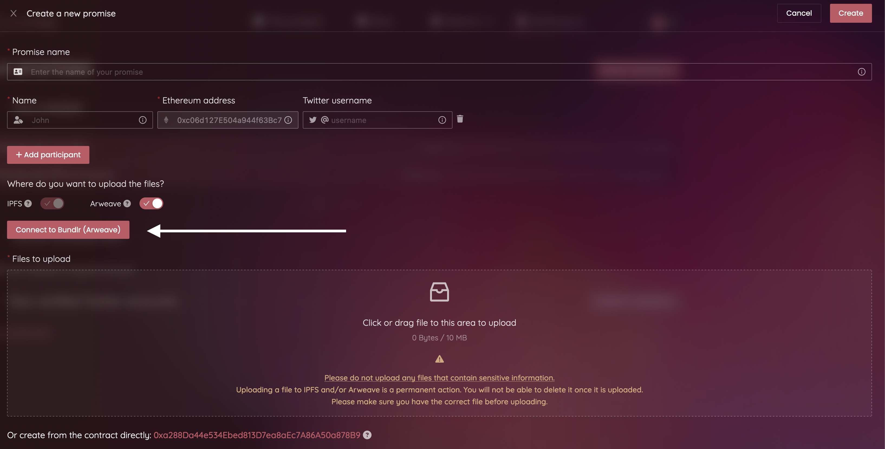

# Exploring promises

## Introduction

<figure><figcaption>
Go to the <em>Explore promises</em> page from the menu.
</figcaption></figure>

The _Explore Promises_ page shows the last created promises, and allows you to search through the available content. You can make a search using a promise name, an Ethereum address, the name or the Twitter handle of a participant.

## What does a promise look like?

<figure><figcaption>
An example promise as it is displayed on the App.
</figcaption></figure>

All information and variables of the promise are stored on-chain, in its own smart contract, and fetched before it can be displayed. The content is requested from IPFS to be displayed as well. There are various sections in the promise card:

Contract address

The address of the contract, generated by the factory when the promise was created. It holds all information, and only its participants can interact with it.

IPFS CID

The IPFS hash pointing to the content uploaded by the creator of the promise.

The verification status

Shown as a Ribbon, the verification status is the result of the request to the Chainlink External Adapter, to verify the issuance of the promise, and therefore the reliability of the provided links (cf. [ipfs-and-arweave-verification.md](../chainlink-external-adapters/ipfs-and-arweave-verification.md "mention")).

It can hold various states:

_Verification pending..._

\-> The promise was just created, and it is not yet verified.

_Not verified_

\-> The External Adapter could not verify the promise, which means that it was not created through the App. Therefore, the source of the IPFS CID & Arweave ID cannot be insured.

_Verified (IPFS)_

\-> The promise was created using the App. Thus, a deal was made for us to pick up (pin) the content of the promise, through the Filecoin network (cf. [sending-to-the-ipfs-network.md](../ipfs-and-arweave/sending-to-the-ipfs-network.md "mention")).

_Verified (IPFS & Arweave)_

\-> Everything mentioned above + the content was _zipped_ and sent permanently to the Arweave blockchain, using Bundlr. The archive can be downloaded from Arweave by clicking a link, shown when hovering on the badge.

<figure><figcaption>
The verification status.
</figcaption></figure>
