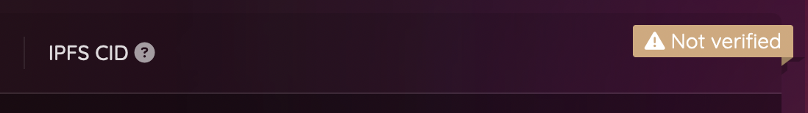

# Verifying a Twitter account


For a comprehensive overview of the verification process with the Chainlink Node, visit [twitter-handle-verification.md](../chainlink-external-adapters/twitter-handle-verification.md "mention").


<figure><figcaption>
Explore the verified Twitter accounts from the menu.
</figcaption></figure>

## Exploring verified Twitter accounts

You can browse the verified Twitter accounts in the **Verified Twitter accounts** page. Right there, you will find a list of Ethereum addresses that verified their ownership of a Twitter account. You can search an address or a handle using the  icon in the appropriate column.

<figure><figcaption>
Verified Twitter accounts associated with their Ethereum address
</figcaption></figure>

## Verifying a Twitter account

There are two ways of verifying a Twitter account with an Ethereum address: from the App, or directly from the contract.

### Using the App

The **Verified Twitter accounts** and **Dashboard** pages both provide a button for verifying a Twitter handle. Clicking it will open a Drawer that explains how it can be achieved.

<figure><figcaption>
The Drawer that enables verifying a Twitter account.
</figcaption></figure>


When interacting with a promise, the instructions are nearly similar, except that the user don't need to input a username. It will try to verify the one that was provided during the creation.


Following this panel instructions, the verification can be done in a few simple steps:

1. Enter a valid Twitter handle.
2.  Click the **Send tweet** button ; it will open Twitter with a pre-written text that will be read during the next step.

    * You can as well just copy the following proof, and navigate to Twitter on your own:

    _Verifying my Twitter account for <mark style="color:red;">`YOUR ADDRESS`</mark> with @usePromise!_
3. Click the **Request verification** button ; it will trigger a request to the Chainlink oracle, with your username and your address as parameters ([detailed explanation here](../chainlink-external-adapters/twitter-handle-verification.md)).
4. Just wait for the verification to be performed...


Once a Twitter handle is verified for an Ethereum address, **it cannot be "unverified", or removed from the list** ; it is the key purpose of this app.



Once verified, a Twitter handle won't need to be verified again for new promises. It will immediately be shown as verified for all promises.

After the verification is done, you can delete the tweet.


## From the contract

<figure><figcaption>
Click the contract address to navigate to Polygonscan.
</figcaption></figure>

The address of the contract is provided at the bottom of the Drawer. Clicking it will open Polygonscan to this address, allowing you to interact straight with the contract.

Once in the `requestVerification` function, you will need to provide the following parameter:

| Parameter   | Example input | Info                 |
| ----------- | ------------- | -------------------- |
| `_username` | 0xpolarzero   | Your Twitter handle. |

Before requesting the verification, you must tweet the following, from the same account:

> _Verifying my Twitter account for <mark style="color:red;">`YOUR ADDRESS`</mark> with @usePromise!_

Once the request sent, you just need to wait until it's been completed.

## Related resources

| App                                                                                                                                                                               |
| --------------------------------------------------------------------------------------------------------------------------------------------------------------------------------- |
| [Twitter verified accounts (TwitterVerifiedTable)](https://github.com/polar0/chainlink-fall-2022-hackathon/blob/main/frontend/components/explore-twitter/TwitterVerifiedTable.js) |
| [Verify Twitter drawer](https://github.com/polar0/chainlink-fall-2022-hackathon/blob/main/frontend/components/user-dashboard/VerifyTwitterDrawer.js)                              |

| Contracts                                                                                                                            |
| ------------------------------------------------------------------------------------------------------------------------------------ |
| [PromiseFactory.sol](https://github.com/polar0/chainlink-fall-2022-hackathon/blob/main/backend/hardhat/contracts/PromiseFactory.sol) |

| Chainlink                                                                                                                                                     |
| ------------------------------------------------------------------------------------------------------------------------------------------------------------- |
| [VerifyTwitter.sol](https://github.com/polar0/chainlink-fall-2022-hackathon/blob/main/backend/hardhat/contracts/VerifyTwitter.sol)                            |
| [VerifyTwitter (unit tests)](https://github.com/polar0/chainlink-fall-2022-hackathon/blob/main/backend/hardhat/test/unit/VerifyTwitterMock.test.js)           |
| [VerifyTwitter (staging tests)](https://github.com/polar0/chainlink-fall-2022-hackathon/blob/main/backend/hardhat/test/staging/VerifyTwitter.staging.test.js) |
| [External Adapter - twitter verification](https://github.com/polar0/chainlink-fall-2022-hackathon/tree/main/backend/chainlink-ea-twitter-verification)        |
| [Operator contract](https://mumbai.polygonscan.com/address/0xd4d1fe6ff0a871ccf37bcfbce3135f548e5f05b5)                                                        |
